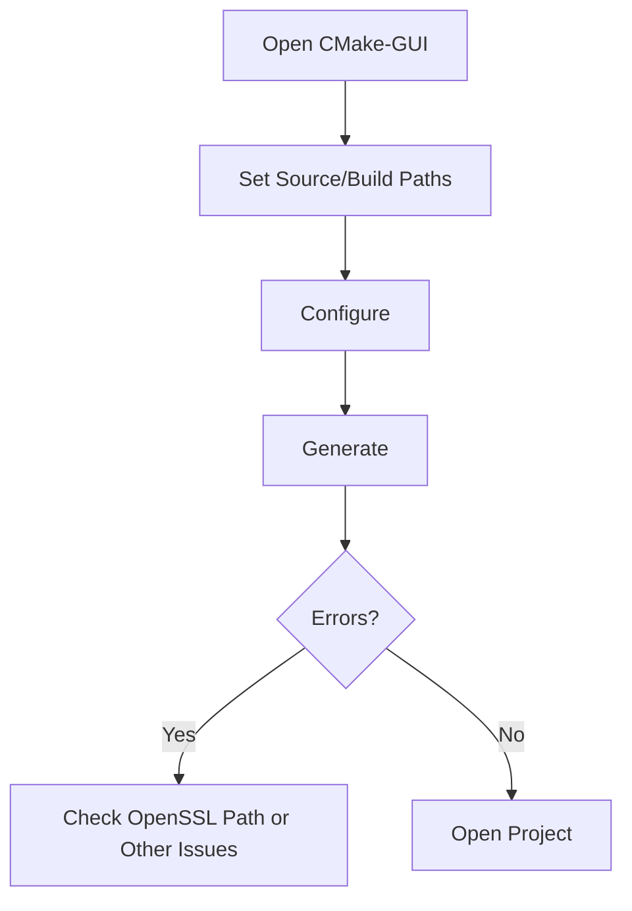

# Compile on Windows

## 1 Dependency Installation

**Essential Components**:
1. **[Visual Studio 2022](https://visualstudio.microsoft.com/downloads/)**  
   Select during installation:
   ```plaintext
   - Desktop development with C++
   - Windows 10/11 SDK (latest version)
   - C++ CMake tools
   ```

    **Note:** If you are using Visual Studio 2019, you need to install the "Windows 10 SDK" version 10.0.18362.0 or later.

2. **[CMake 3.25+](https://cmake.org/download/)**
   ```powershell
   # Verify installation
   cmake --version
   ```

3. **[Git](https://git-scm.com/)**  
    ```powershell
   # Recommended configuration(Configuring the line ending conversions during installation)
   git config --global core.autocrlf true
   ```
   ```powershell
   # Verify installation
   git --version
   ```


**Conditional Libraries**:
   - **[OpenSSL 1.1.1](https://slproweb.com/products/Win32OpenSSL.html)**  
      ```cmake
      # Set in CMake-GUI
      set(OPENSSL_ROOT_DIR "C:\Program Files\OpenSSL-Win64") 
      ```
   
   - [PCL 1.12.1](https://github.com/PointCloudLibrary/pcl/releases) - Windows prebuilt binaries

**Optional Tools**:  
   - [vcpkg](https://github.com/microsoft/vcpkg) (for managing pcap/yaml-cpp libraries)


## 2 CMake Configuration

**Example**：(Here is an example of how to compile [test.cc](..\test\test.cc).)
```plaintext
   Source code:    D:/HesaiLidar_SDK_2.0	# Modify according to actual path
   Build dir:      D:/HesaiLidar_SDK_2.0/build	# Modify according to actual path
   ```
## 3 Visual Studio Compilation
**Build Steps**:
1. Select build configuration:
   ```cpp
   // IDE Toolbar Settings
   Solution Configuration: Debug/Release	# Modify according to actual configuration, here is Debug
   Solution Platform: x64
   ```

2. Configure project properties:
   ```powershell
   Right-click sample → Properties → 
   C/C++ → Preprocessor → 
   Preprocessor Definitions → Edit →
   Add "NOMINMAX"
   ```

3. Build solution:
   ```bash
   # Full solution build
   Right-click solution → Build Solution

   # Single project build
   Right-click sample → Build
   ```

**Verification**:
```powershell
# Check executable
cd build/Debug
.\sample.exe --version
```

## 4 Advanced Configuration
**Permanent NOMINMAX Setting**:
```cmake
# Add to CMakeLists.txt
add_definitions(-DNOMINMAX)

# Or target-specific
target_compile_definitions(sample PRIVATE NOMINMAX)
```

## 5 Troubleshooting
**Common Errors**:
1. **LNK2005 Duplicate Symbols**:
   ```cmake
   # Project Properties → Linker → Command Line
   /FORCE:MULTIPLE
   ```

2. **C4996 Deprecation Warnings**:
   ```cpp
   // Preprocessor Definitions
   _SILENCE_ALL_DEPRECATION_WARNINGS
   ```

3. **Windows Path Length Limit**:
   ```reg
   Windows Registry Editor Version 5.00
   [HKEY_LOCAL_MACHINE\SYSTEM\CurrentControlSet\Control\FileSystem]
   "LongPathsEnabled"=dword:00000001
   ```

**Build Success Indicators**:
```log
- Output Window: "========== Build: 1 succeeded, 0 failed =========="
- Executable Location: 
  Debug: build/Debug/sample.exe
  Release: build/Release/sample.exe
```