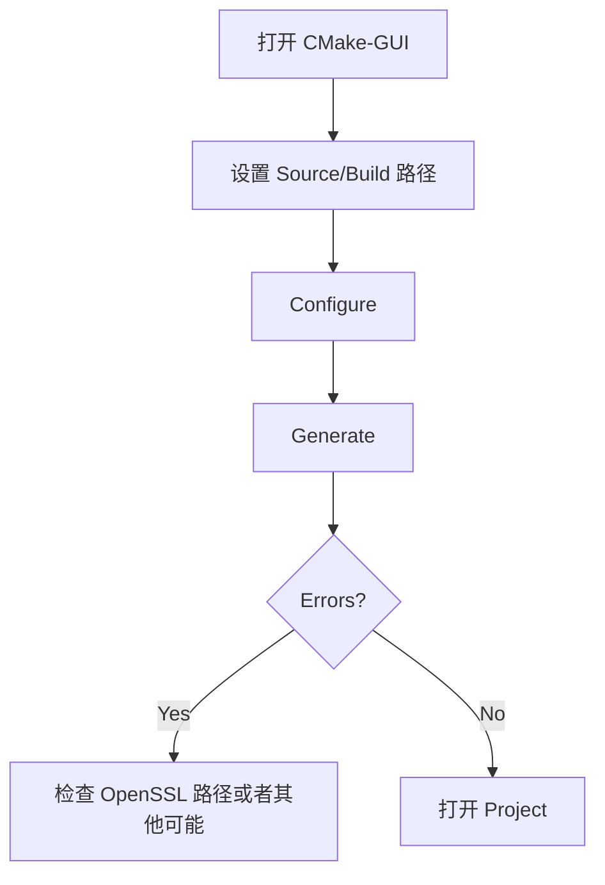

# 如何在Windows下编译SDK

## 1 依赖项安装

**基本组件**:
1. **[Visual Studio 2022](https://visualstudio.microsoft.com/downloads/)**  
   在安装时需要选择以下组件:
   ```plaintext
   - Desktop development with C++
   - Windows 10/11 SDK (latest version)
   - C++ CMake tools
   ```

    **注意:** 如果你使用的是 Visual Studio 2019，你需要安装 "Windows 10 SDK" 10.0.18362.0 或者更高版本。

2. **[CMake 3.25+](https://cmake.org/download/)**
   ```powershell
   # 验证安装
   cmake --version
   ```

3. **[Git](https://git-scm.com/)**  
    ```powershell
   # 推荐配置（在安装期间对行尾换行转换的配置）
   git config --global core.autocrlf true
   ```
   ```powershell
   # 验证安装
   git --version
   ```


**条件库**:
   - **[OpenSSL 1.1.1](https://slproweb.com/products/Win32OpenSSL.html)**（部分机械雷达有SSL的PTCS通讯需要使用）
      ```cmake
      # 在 CMake-GUI 中设置 OpenSSL 路径
      set(OPENSSL_ROOT_DIR "C:\Program Files\OpenSSL-Win64") 
      ```
   
   - [PCL 1.12.1](https://github.com/PointCloudLibrary/pcl/releases) (基于PCL库的应用程序需要使用，例如点云可视化)

**Optional Tools**:  
   - [vcpkg](https://github.com/microsoft/vcpkg) (用于管理 pcap/yaml-cpp 库)


## 2 CMake配置

**例**：(下面是一个例子用于编译 [test.cc](..\test\test.cc).)
```plaintext
   Source code:    D:/HesaiLidar_SDK_2.0	# Modify according to actual path
   Build dir:      D:/HesaiLidar_SDK_2.0/build	# Modify according to actual path
   ```
## 3 Visual Studio 编译
**编译步骤**:
1. 选择编译配置:
   ```cpp
   // IDE Toolbar Settings
   Solution Configuration: Debug/Release	# 根据实际配置进行调整，这里是用 Debug 配置
   Solution Platform: x64
   ```

2. 配置项目属性:
   ```powershell
   右键点击 sample → Properties → 
   C/C++ → Preprocessor → 
   Preprocessor Definitions → Edit →
   添加 "NOMINMAX"
   ```

3. 构建解决方案:
   ```bash
   # 构建完整解决方案
   Right-click solution → Build Solution

   # 构建单项目解决方案
   Right-click sample → Build
   ```

**验证**:
```powershell
# 检查可执行性
cd build/Debug
.\sample.exe --version
```

## 4 高级配置
**永久性 NOMINMAX 设置**:
```cmake
# 添加到 CMakeLists.txt
add_definitions(-DNOMINMAX)

# 或 靶向性
target_compile_definitions(sample PRIVATE NOMINMAX)
```

## 5 故障排查
**常见报错**:
1. **LNK2005 Duplicate Symbols**:
   ```cmake
   # Project Properties → Linker → Command Line
   /FORCE:MULTIPLE
   ```

2. **C4996 Deprecation Warnings**:
   ```cpp
   // Preprocessor Definitions
   _SILENCE_ALL_DEPRECATION_WARNINGS
   ```

3. **Windows Path Length Limit**:
   ```reg
   Windows Registry Editor Version 5.00
   [HKEY_LOCAL_MACHINE\SYSTEM\CurrentControlSet\Control\FileSystem]
   "LongPathsEnabled"=dword:00000001
   ```

**构建成功指示**:
```log
- Output Window: "========== Build: 1 succeeded, 0 failed =========="
- Executable Location: 
  Debug: build/Debug/sample.exe
  Release: build/Release/sample.exe
```